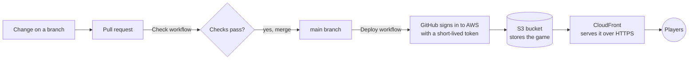

# 🏰 Cinderella's Midnight Maze

**The clock strikes midnight!** The stepfamily is chasing Cinderella through the palace halls. Collect every pearl, grab a glass slipper to turn them into mice, and outrun them through 20 levels to reach her happily ever after.

### ▶ [Play the game](https://djupknnfwqky.cloudfront.net)

[](https://djupknnfwqky.cloudfront.net)

## 📖 Game Overview

A free, fast-paced arcade maze chase through the royal palace, inspired by a classic fairy tale. Guide Cinderella through the twisting royal halls, outrun her wicked stepfamily, gather all the pearls, and snag a magical glass slipper to turn your pursuers into mice. Clear all 20 levels to claim your happily-ever-after ending!

**How to play**

- **Move:** arrow keys or W A S D
- **Twirl past the family:** Space
- **On a phone:** swipe, or use the on-screen pad

## 🎮 Key Features

- **Classic arcade action:** sprint through the palace maze in a high-stakes chase.
- **Turn the tables:** grab a glass slipper to transform the stepfamily into harmless mice and reverse the hunt.
- **A fairy-tale journey:** 20 levels, each with its own line of the story and its own surprises from the tale.
- **A magic twirl:** a burst of speed that slips Cinderella past the family when she's cornered.
- **Easy mode** for younger players, and a **Top 10** of the best scores.
- **100% free to play:** the whole story and every level, with no ads or paywalls.

## 🚀 Live Game

- **Play:** https://djupknnfwqky.cloudfront.net

## 🛠️ Tech Stack & Architecture

- **Game:** HTML5 Canvas and plain JavaScript in a single page (`cinderella-maze.html`), with no framework and no image files. Music and sound effects are generated with the Web Audio API.
- **Hosting & delivery:** AWS S3 (private storage) behind AWS CloudFront (CDN, HTTPS).
- **Infrastructure as code:** one AWS CloudFormation template, `infra/site.yaml`.
- **CI/CD:** GitHub Actions.
- **Design & prototyping:** built with Claude, using claude.ai artifacts for previews.



The game runs entirely in the player's browser; there is no server. Top 10 scores are kept in each player's own browser on this site.

## ⚙️ Installation & Local Setup

You need [Node.js](https://nodejs.org) (version 18 or later) and Python 3.

1. **Clone the repository**

   ```bash
   git clone https://github.com/ok-kewei/cinderella-maze.git
   cd cinderella-maze
   ```

2. **Check and build the game**

   ```bash
   node scripts/check.mjs   # makes sure the game's code has no errors
   node scripts/build.mjs   # creates the playable page at dist/index.html
   ```

3. **Run a local server**

   ```bash
   cd dist
   python3 -m http.server 8000
   ```

4. **Open the game** at http://localhost:8000

## 📦 CI/CD & Deployment Guide

The game deploys to AWS automatically whenever a change is merged into the `main` branch.

### Workflows

- **Check** (`.github/workflows/check.yml`) runs on every pull request: it checks the game's code for errors and builds the page.
- **Deploy** (`.github/workflows/deploy.yml`) runs on every merge to `main`:
  1. checks and builds the game,
  2. signs in to AWS (see below),
  3. uploads the page to the S3 bucket,
  4. refreshes CloudFront so players get the new version within about a minute.

### Signing in to AWS without stored keys

GitHub signs in to AWS with **OpenID Connect (OIDC)**: on each run, GitHub issues a short-lived token proving the job comes from this repository's `main` branch, and AWS exchanges it for temporary credentials. **No AWS access keys or passwords are stored in GitHub.** The deploy role can only upload to this game's bucket and refresh its CloudFront site.

### Repository variables

These are set under **Settings → Secrets and variables → Actions → Variables**. They are not secret; they tell the workflow where to deploy:

| Variable | What it is |
|---|---|
| `AWS_DEPLOY_ROLE_ARN` | The deploy role GitHub signs in as |
| `AWS_REGION` | The AWS region, `us-east-1` |
| `SITE_BUCKET` | The S3 bucket that stores the game |
| `CLOUDFRONT_DISTRIBUTION_ID` | The CloudFront site to refresh after each upload |

<details>
<summary><strong>Setting up AWS from scratch</strong> (already done; only needed to rebuild everything)</summary>

1. Look up the repository's permanent ids, which GitHub includes when it signs in to AWS:

   ```bash
   gh api repos/<github-user>/<repo> --jq '.owner.id, .id'
   ```

2. Create the AWS resources from the template:

   ```bash
   aws cloudformation deploy \
     --stack-name cinderella-maze \
     --template-file infra/site.yaml \
     --capabilities CAPABILITY_NAMED_IAM \
     --parameter-overrides GitHubOwner=<github-user> GitHubRepo=<repo> \
       GitHubOwnerId=<owner-id> GitHubRepoId=<repo-id> BudgetEmail=<email>
   ```

3. Read the four values from the stack's outputs and add them as the repository variables above:

   ```bash
   aws cloudformation describe-stacks --stack-name cinderella-maze --query "Stacks[0].Outputs"
   ```

</details>
