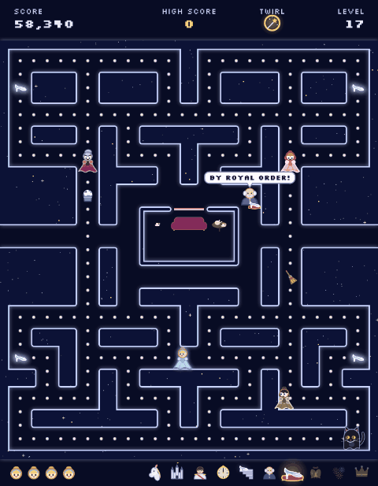
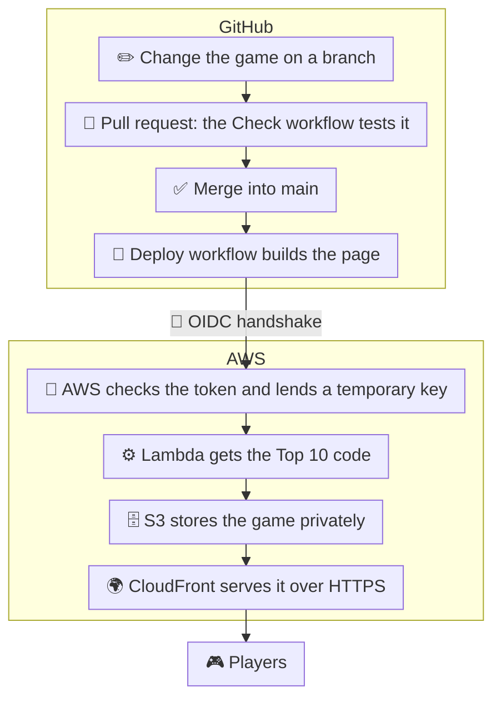
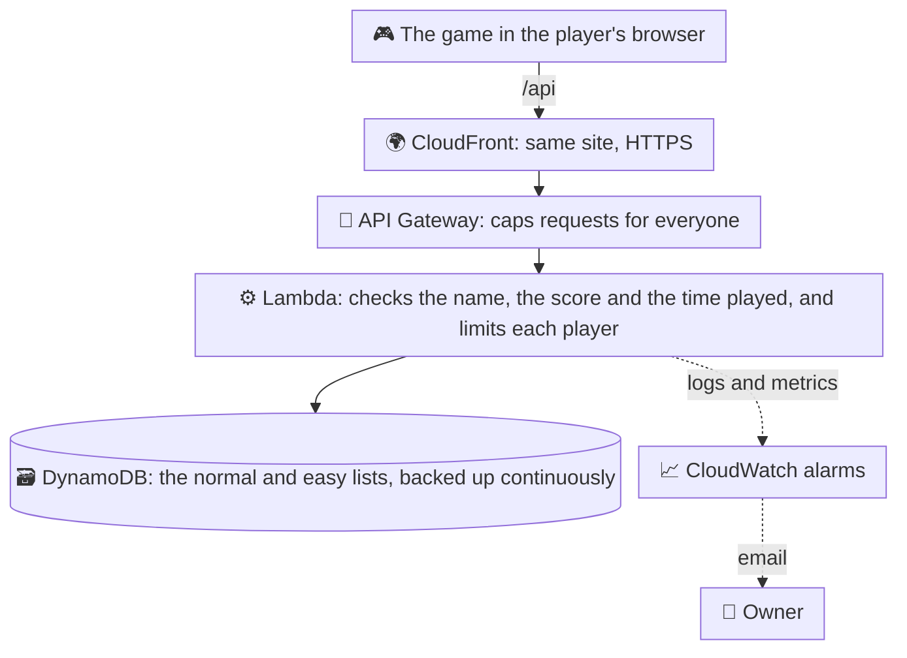

# 🏰 Cinderella's Midnight Maze

**The clock strikes midnight!** The stepfamily is chasing Cinderella through the palace halls. Collect every pearl, grab a glass slipper to turn them into mice, and outrun them through 20 levels to reach her happily ever after.

### ▶ [Play the game](https://djupknnfwqky.cloudfront.net)

[](https://djupknnfwqky.cloudfront.net)

## 📖 Game Overview

A free, fast-paced arcade maze chase through the royal palace, inspired by a classic fairy tale. Guide Cinderella through the twisting royal halls, outrun her wicked stepfamily, gather all the pearls, and snag a magical glass slipper to turn your pursuers into mice. Clear all 20 levels to claim your happily-ever-after ending!

**How to play**

- **Move:** arrow keys or W A S D
- **Twirl past the family:** Space
- **On a phone:** swipe, or use the on-screen pad

## 🛠️ Tech Stack & Architecture

- **Game:** HTML5 Canvas and plain JavaScript in a single page (`cinderella-maze.html`), with no framework and no image files. Music and sound effects are generated with the Web Audio API.
- **Hosting & delivery:** AWS S3 (private storage) behind AWS CloudFront (CDN, HTTPS).
- **Shared Top 10:** CloudFront sends `/api` requests to an API Gateway HTTP API, which runs a Node.js AWS Lambda function (`api/`). Scores are stored in Amazon DynamoDB, with one table holding both lists (normal and easy).
- **Monitoring:** CloudWatch logs and alarms, emailed through SNS.
- **Infrastructure as code:** one AWS CloudFormation template, `infra/site.yaml`.
- **CI/CD:** GitHub Actions.
- **Tooling:** Node.js runs the helper scripts (check, build, smoke test) and the API's unit tests (`node --test`). Players don't need it.
- **Design & prototyping:** built with Claude, using claude.ai artifacts for previews.



### How a score reaches the Top 10



- **Fair scores:** each game starts a session on the server, so the server knows when the game began. A score has to be possible for the level reached and the time played. Names have to pass character rules and a word list. Each game can save one score.
- **Reliable saving:** if a score can't be sent, the game retries a few times, then keeps it on the device and sends it when the player is back online or next opens the game. Players only see a small "saving…" next to their name. Sending a score twice still saves it once.
- **Limits:** API Gateway caps total traffic, the function limits how many games and scores each player can send per hour, and DynamoDB has a throughput ceiling, so a flood of requests can't run up costs.
- **Backups:** DynamoDB point-in-time recovery can restore the scores to any second in the last 35 days.

## ⚙️ Installation & Local Setup

You need [Node.js](https://nodejs.org) (version 18 or later).

1. **Clone the repository**

   ```bash
   git clone https://github.com/ok-kewei/cinderella-maze.git
   cd cinderella-maze
   ```

2. **Check, test and build the game**

   ```bash
   node scripts/check.mjs            # makes sure the game's code has no errors
   node --test api/test/*.test.mjs   # tests the Top 10 API's rules
   node scripts/build.mjs            # builds the playable page
   ```

   The build creates a new folder, `dist`, with one file inside: `index.html`. That's the game (`cinderella-maze.html`) wrapped as a complete web page, ready for a browser. The `dist` folder isn't stored in git, because the build can always recreate it.

3. **Play it:** open `dist/index.html` in your web browser, for example by double-clicking it in your file manager. Opened this way, the Top 10 is kept on your device only.

## 📦 CI/CD & Deployment Guide

The game deploys to AWS automatically whenever a change is merged into the `main` branch.

### Workflows

- **Check** (`.github/workflows/check.yml`) runs on every pull request: it checks the game's code for errors, runs the API's unit tests and builds the page.
- **Deploy** (`.github/workflows/deploy.yml`) runs on every merge to `main`:
  1. checks, tests and builds the game,
  2. signs in to AWS (see below),
  3. uploads the Top 10 code to Lambda (first, so the new page never talks to an old API),
  4. uploads the page to the S3 bucket,
  5. refreshes CloudFront so players get the new version within about a minute,
  6. runs a smoke test on the live site (`scripts/smoke.mjs`): the page loads and the Top 10 answers.

Deploys sign in to AWS with a short-lived token (OIDC), so no AWS keys or passwords are stored in GitHub.

<details>
<summary><strong>Setting up AWS from scratch with CloudFormation</strong></summary>

Everything on AWS is created from one CloudFormation template, `infra/site.yaml`. You run it from your own computer with the AWS command-line tool, and AWS creates all the resources as one **stack** called `cinderella-maze`. Run each command below in a terminal, **inside the project folder** (`cinderella-maze`).

1. **Sign in to AWS and GitHub on the command line.**
   - Install the [AWS CLI](https://docs.aws.amazon.com/cli/latest/userguide/getting-started-install.html) and sign in to your AWS account (for example with `aws configure`). The AWS user you sign in as needs permission to create S3, CloudFront, IAM, Budgets, DynamoDB, Lambda, API Gateway, CloudWatch and SNS resources. `aws sts get-caller-identity` shows which account and user the CLI is signed in as.
   - Install the [GitHub CLI](https://cli.github.com) and sign in with `gh auth login`.

2. **Find the repository's id numbers.** GitHub includes them when it signs in to AWS, so the template needs them:

   ```bash
   gh api repos/ok-kewei/cinderella-maze --jq '.owner.id, .id'
   ```

   `gh api` asks GitHub for the repository's details, which come back as JSON. `--jq` filters that JSON before printing it, using [jq](https://jqlang.org) syntax (built into `gh`): `.owner.id` is the account's id and `.id` is the repository's id. It prints the two numbers, one per line, for example:

   ```text
   43628709      <- owner id
   1399184698    <- repository id
   ```

   It only reads from GitHub; nothing changes.

3. **Create the stack.** Put in the two numbers from step 2 and the email that should receive cost and health alerts:

   ```bash
   aws cloudformation deploy \
     --stack-name cinderella-maze \
     --template-file infra/site.yaml \
     --capabilities CAPABILITY_NAMED_IAM \
     --region us-east-1 \
     --parameter-overrides GitHubOwner=ok-kewei GitHubRepo=cinderella-maze \
       GitHubOwnerId=<owner-id> GitHubRepoId=<repo-id> BudgetEmail=<your-email>
   ```

   `--capabilities CAPABILITY_NAMED_IAM` is a fixed CloudFormation keyword you type to acknowledge that the template creates IAM resources (the GitHub sign-in link and the deploy role), which grant permissions in your account. CloudFormation won't create them without it.

   It takes a few minutes and finishes with `Successfully created/updated stack - cinderella-maze`. AWS then emails you twice: once from Budgets, and once from SNS, asking you to confirm the alert subscription. Click **Confirm subscription**, or the alarms can't email you. You can also follow it in the AWS Console under **CloudFormation → Stacks**. Running the same command again later updates the stack with any changes to the template.

4. **Give GitHub the values it needs to deploy.** Read them from the stack's outputs:

   ```bash
   aws cloudformation describe-stacks --stack-name cinderella-maze --region us-east-1 --query "Stacks[0].Outputs"
   ```

   Then add each one as a repository variable, either on the website (**Settings → Secrets and variables → Actions → Variables → New repository variable**) or with `gh`, for example `gh variable set AWS_REGION --body us-east-1`. They are not secret; they tell the Deploy workflow where to upload:

   | Variable | Value (from the stack's outputs) |
   |---|---|
   | `AWS_DEPLOY_ROLE_ARN` | `DeployRoleArn`: the deploy role GitHub signs in as |
   | `AWS_REGION` | `us-east-1` |
   | `SITE_BUCKET` | `BucketName`: the S3 bucket that stores the game |
   | `CLOUDFRONT_DISTRIBUTION_ID` | `DistributionId`: the CloudFront site to refresh after each upload |
   | `API_FUNCTION_NAME` | `ApiFunctionName`: the Lambda function that runs the Top 10 |
   | `SITE_URL` | `SiteUrl`: where the smoke test checks the live site |

**How the OIDC sign-in is set up.** There's nothing to configure by hand. The template creates both pieces on AWS: the identity provider that trusts GitHub's tokens, and the deploy role, which only accepts tokens from this repository's `main` branch. On GitHub, `deploy.yml` already asks for a token (`permissions: id-token: write`) and signs in with the role from `AWS_DEPLOY_ROLE_ARN`. Once steps 1 to 4 are done, the next merge to `main` deploys. Until that first deploy, the Top 10 function holds a placeholder that answers "not deployed yet".

</details>
