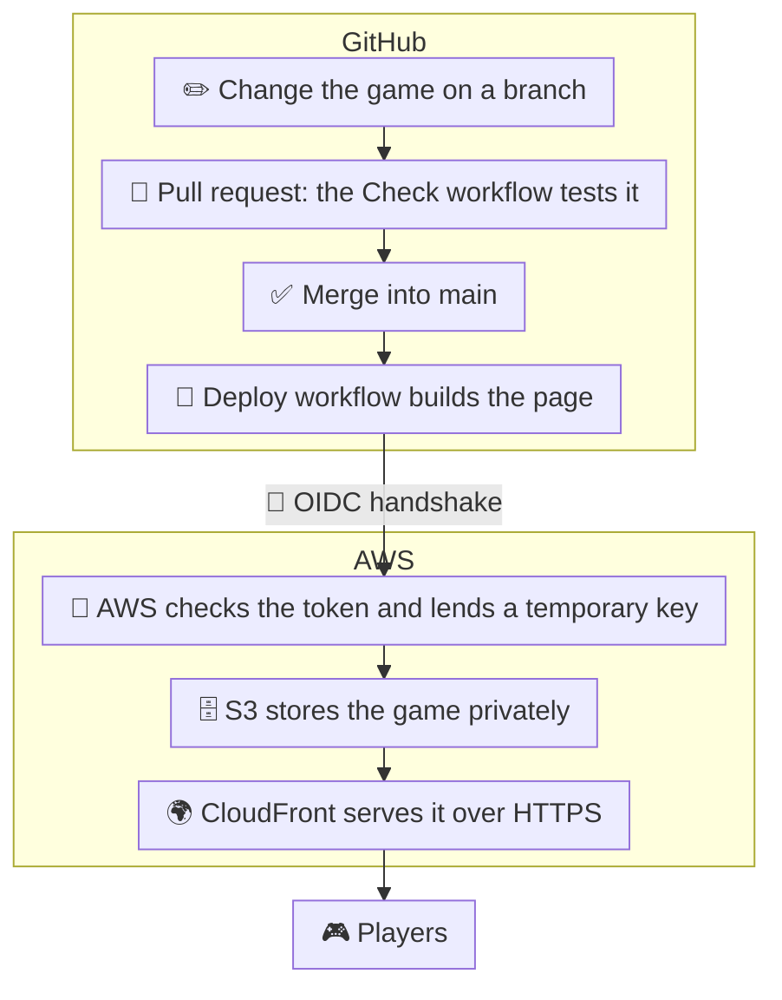

# 🏰 Cinderella's Midnight Maze

**The clock strikes midnight!** The stepfamily is chasing Cinderella through the palace halls. Collect every pearl, grab a glass slipper to turn them into mice, and outrun them through 20 levels to reach her happily ever after.

### ▶ [Play the game](https://djupknnfwqky.cloudfront.net)

[](https://djupknnfwqky.cloudfront.net)

## 📖 Game Overview

A free, fast-paced arcade maze chase through the royal palace, inspired by a classic fairy tale. Guide Cinderella through the twisting royal halls, outrun her wicked stepfamily, gather all the pearls, and snag a magical glass slipper to turn your pursuers into mice. Clear all 20 levels to claim your happily-ever-after ending!

**How to play**

- **Move:** arrow keys or W A S D
- **Twirl past the family:** Space
- **On a phone:** swipe, or use the on-screen pad

## 🛠️ Tech Stack & Architecture

- **Game:** HTML5 Canvas and plain JavaScript in a single page (`cinderella-maze.html`), with no framework and no image files. Music and sound effects are generated with the Web Audio API.
- **Hosting & delivery:** AWS S3 (private storage) behind AWS CloudFront (CDN, HTTPS).
- **Infrastructure as code:** one AWS CloudFormation template, `infra/site.yaml`.
- **CI/CD:** GitHub Actions.
- **Tooling:** Node.js runs the two small helper scripts that check and build the page. Players don't need it.
- **Design & prototyping:** built with Claude, using claude.ai artifacts for previews.



## ⚙️ Installation & Local Setup

You need [Node.js](https://nodejs.org) (version 18 or later).

1. **Clone the repository**

   ```bash
   git clone https://github.com/ok-kewei/cinderella-maze.git
   cd cinderella-maze
   ```

2. **Check and build the game**

   ```bash
   node scripts/check.mjs   # makes sure the game's code has no errors
   node scripts/build.mjs   # builds the playable page
   ```

   The build creates a new folder, `dist`, with one file inside: `index.html`. That's the game (`cinderella-maze.html`) wrapped as a complete web page, ready for a browser. The `dist` folder isn't stored in git, because the build can always recreate it.

3. **Play it:** open `dist/index.html` in your web browser, for example by double-clicking it in your file manager.

## 📦 CI/CD & Deployment Guide

The game deploys to AWS automatically whenever a change is merged into the `main` branch.

### Workflows

- **Check** (`.github/workflows/check.yml`) runs on every pull request: it checks the game's code for errors and builds the page.
- **Deploy** (`.github/workflows/deploy.yml`) runs on every merge to `main`:
  1. checks and builds the game,
  2. signs in to AWS (see below),
  3. uploads the page to the S3 bucket,
  4. refreshes CloudFront so players get the new version within about a minute.

Deploys sign in to AWS with a short-lived token (OIDC), so no AWS keys or passwords are stored in GitHub.

<details>
<summary><strong>Setting up AWS from scratch with CloudFormation</strong></summary>

Everything on AWS is created from one CloudFormation template, `infra/site.yaml`. You run it from your own computer with the AWS command-line tool, and AWS creates all the resources as one **stack** called `cinderella-maze`.

**You need**

- The [AWS CLI](https://docs.aws.amazon.com/cli/latest/userguide/getting-started-install.html), signed in to your AWS account with permission to create resources. Check with `aws sts get-caller-identity`, which should print your account.
- The [GitHub CLI](https://cli.github.com) (`gh`), signed in with `gh auth login`.

Run each command below in a terminal, **inside the project folder** (`cinderella-maze`).

1. **Find the repository's ids.** GitHub includes them when it signs in to AWS, so the template needs them. For this repository:

   ```bash
   gh api repos/ok-kewei/cinderella-maze --jq '.owner.id, .id'
   ```

   This only reads information from GitHub. It prints two numbers: the first is the owner id, the second is the repository id.

2. **Create the stack.** Replace the values in `<...>` with your own (the two ids from step 1, and the email that should receive cost alerts):

   ```bash
   aws cloudformation deploy \
     --stack-name cinderella-maze \
     --template-file infra/site.yaml \
     --capabilities CAPABILITY_NAMED_IAM \
     --region us-east-1 \
     --parameter-overrides GitHubOwner=ok-kewei GitHubRepo=cinderella-maze \
       GitHubOwnerId=<owner-id> GitHubRepoId=<repo-id> BudgetEmail=<your-email>
   ```

   It takes a few minutes and finishes with `Successfully created/updated stack - cinderella-maze`. You can also follow it in the AWS Console under **CloudFormation → Stacks**. Running the same command again later updates the stack with any changes to the template.

3. **Give GitHub the values it needs to deploy.** Read them from the stack's outputs:

   ```bash
   aws cloudformation describe-stacks --stack-name cinderella-maze --region us-east-1 --query "Stacks[0].Outputs"
   ```

   and add them under **Settings → Secrets and variables → Actions → Variables** in the GitHub repository. They are not secret; they tell the Deploy workflow where to upload:

   | Variable | What it is |
   |---|---|
   | `AWS_DEPLOY_ROLE_ARN` | The deploy role GitHub signs in as |
   | `AWS_REGION` | The AWS region, `us-east-1` |
   | `SITE_BUCKET` | The S3 bucket that stores the game |
   | `CLOUDFRONT_DISTRIBUTION_ID` | The CloudFront site to refresh after each upload |

</details>
