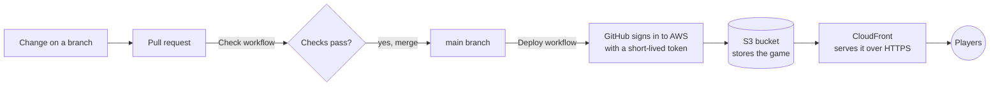

# Cinderella's Midnight Maze

A free arcade maze chase through the palace. Collect every pearl before the stepfamily catches you, grab a glass slipper to turn them into mice, and play through 20 levels of the tale to reach the happily-ever-after ending.

### ▶ [Play the game](https://djupknnfwqky.cloudfront.net)

[](https://djupknnfwqky.cloudfront.net)

Arrow keys or WASD to move, Space to twirl past the family. On a phone, swipe or use the on-screen pad.

## How it goes live

Every change takes the same path from this repository to the players:



1. **Pull request.** Every change starts as a pull request. The **Check** workflow (`.github/workflows/check.yml`) makes sure the game's code has no errors and that the page can be built.
2. **Merge.** Merging the pull request into `main` starts the **Deploy** workflow (`.github/workflows/deploy.yml`).
3. **Sign in to AWS.** GitHub proves to AWS that the request really comes from this repository's `main` branch, and AWS lends it a temporary key that can only update this game. No passwords or permanent keys are stored anywhere.
4. **Upload.** The workflow builds the page (`scripts/build.mjs`) and uploads it to a private **S3** bucket, which nobody can open directly.
5. **Serve.** **CloudFront**, AWS's worldwide delivery network, serves the game to players over HTTPS and refreshes its copies so everyone gets the new version within about a minute.

### What runs where

| Part | What it does |
|---|---|
| `cinderella-maze.html` | The whole game: one page with its own styles and script. It runs entirely in the player's browser; there is no server. |
| GitHub Actions | Checks every pull request, and deploys whatever lands on `main`. |
| AWS S3 | Stores the built page, privately. |
| AWS CloudFront | Delivers it to players, fast and over HTTPS. |
| AWS IAM | The deploy role GitHub signs in with: it can only upload this game and refresh its CloudFront site. |
| AWS Budgets | Emails the owner if monthly costs pass $1. |

All of the AWS parts are described in one CloudFormation template, `infra/site.yaml`, so the setup can be reviewed, changed or rebuilt as a whole. Top 10 scores are kept in each player's own browser on this site.

## Working on the game

```bash
node scripts/check.mjs   # check the game for errors
node scripts/build.mjs   # build dist/index.html, then open it in a browser to play locally
```

Design preview pages live in `previews/` on the owner's computer and are not part of this repository.

<details>
<summary><strong>One-time setup</strong> (already done; only needed to rebuild everything from scratch)</summary>

1. Look up the repository's permanent ids, which GitHub includes when it signs in to AWS:

   ```bash
   gh api repos/<github-user>/<repo> --jq '.owner.id, .id'
   ```

2. Create the AWS resources from the template:

   ```bash
   aws cloudformation deploy \
     --stack-name cinderella-maze \
     --template-file infra/site.yaml \
     --capabilities CAPABILITY_NAMED_IAM \
     --parameter-overrides GitHubOwner=<github-user> GitHubRepo=<repo> \
       GitHubOwnerId=<owner-id> GitHubRepoId=<repo-id> BudgetEmail=<email>
   ```

3. Give GitHub the four values it needs to deploy. Read them from the stack's outputs:

   ```bash
   aws cloudformation describe-stacks --stack-name cinderella-maze --query "Stacks[0].Outputs"
   ```

   and add them under **Settings → Secrets and variables → Actions → Variables**:
   `AWS_DEPLOY_ROLE_ARN`, `AWS_REGION`, `SITE_BUCKET`, `CLOUDFRONT_DISTRIBUTION_ID`.

</details>
